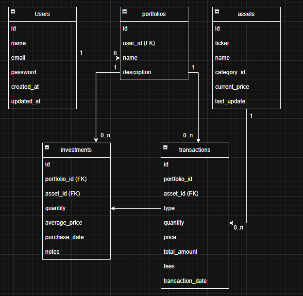

<p align="center">
  
  
  
  
  
</p>

<h1 align="center">💰 NomismaVault</h1>

<p align="center">
  <strong>REST API for financial asset tracking, portfolio performance and B3 market data integration</strong>
</p>

<p align="center">
  <a href="#-about">About</a> •
  <a href="#-features">Features</a> •
  <a href="#%EF%B8%8F-architecture">Architecture</a> •
  <a href="#-tech-stack">Stack</a> •
  <a href="#-api-documentation">API Docs</a> •
  <a href="#-getting-started">Run</a> •
  <a href="#-testing">Testing</a> •
  <a href="#-dashboard">Dashboard</a> •
  <a href="#-roadmap">Roadmap</a>
</p>

---

## 📋 About

**NomismaVault** is a complete RESTful API for personal financial asset tracking, built with software engineering best practices. The project allows you to manage multiple portfolios, record buy/sell transactions, monitor real-time performance (P&L), and receive price alerts.

> *"Nomisma"* (νόμισμα) means "coin" in ancient Greek — the etymological origin of the term "numismatics".

### Technical Highlights

- **Layered architecture** well-defined (Controller → Service → Repository)
- **External API integration** (Brapi - real-time B3 data)
- **Scheduled Jobs** for automatic price updates
- **Financial calculations** (profitability, P&L, average price)
- **Robust validations** with Bean Validation
- **Caching** to optimize external API calls
- **Versioned migrations** with Flyway
- **Docker-ready** with multi-stage build
- **JWT Authentication** with Spring Security

---

## Features

### Implemented

#### User Management
- Full CRUD operations
- Unique email validation
- BCrypt password encryption
- Relationship with portfolios and alerts

#### Authentication & Security
- JWT token-based authentication
- Login and registration endpoints
- Stateless session management
- Protected routes with Spring Security
- Public endpoints: `/auth/**`, `/health`, Swagger UI

#### Portfolios
- Multiple portfolios per user
- Unique name per user
- Paginated listing with sorting

#### Investments
- Position tracking (asset, quantity, average price)
- **Real-time P&L calculation** via Brapi integration
- Automatic average price update on purchases
- Unique constraint (portfolio + asset)

#### Transactions
- Buy/sell history
- Date range filtering
- Automatic fee calculation

#### Assets
- Registration of stocks, REITs, crypto, fixed income
- Search by ticker
- Categorization with risk levels

#### Price Alerts
- Set ABOVE/BELOW alerts
- Automatic check every 5 minutes (market hours)
- Triggered alerts history

#### Brapi Integration
- Real-time B3 quotes
- Request caching
- Error fallback

#### Schedulers
- **PriceUpdateScheduler**: Updates prices daily at 6 PM (after market close)
- **PriceAlertScheduler**: Checks alerts every 5 min (10 AM - 6 PM)

---

### Package Structure

```
src/main/java/com/davidantasdev/nomismavault/
├── config/                 # Configurations (RestTemplate, Swagger, etc)
├── controller/             # REST Controllers
│   ├── AssetController
│   ├── AuthenticationController
│   ├── HealthController
│   ├── InvestmentCategoryController
│   ├── InvestmentController
│   ├── PortfolioController
│   ├── PriceAlertController
│   ├── PriceHistoryController
│   ├── TransactionController
│   └── UserController
├── dto/
│   ├── integration/        # Brapi API DTOs
│   ├── request/            # Input DTOs
│   └── response/           # Output DTOs
├── entity/                 # JPA Entities
│   └── enums/              # Enums (TransactionType, RiskLevel, AlertCondition)
├── exception/              # Global error handling
├── integration/            # External API clients
├── mapper/                 # MapStruct Mappers
├── repository/             # Spring Data JPA Repositories
├── scheduler/              # Scheduled Jobs
├── security/               # Security configurations (JWT, Filters)
└── service/                # Business logic
```

---

## Tech Stack

| Layer | Technology | Version |
|-------|------------|---------|
| **Runtime** | Java (Eclipse Temurin) | 21 LTS |
| **Framework** | Spring Boot | 4.0.1 |
| **Persistence** | Spring Data JPA + Hibernate | - |
| **Database** | PostgreSQL | 15 |
| **Migrations** | Flyway | - |
| **Validation** | Bean Validation (Jakarta) | - |
| **Mapping** | MapStruct | 1.5.5 |
| **Boilerplate** | Lombok | - |
| **Cache** | Spring Cache (Simple) | - |
| **Security** | Spring Security + JWT (Auth0) | 4.2.1 |
| **Documentation** | SpringDoc OpenAPI (Swagger) | 2.8.5 |
| **Container** | Docker + Docker Compose | - |
| **External API** | Brapi (B3 Data) | - |

---

## API Documentation

Complete interactive documentation available at:

```
http://localhost:8080/swagger-ui.html
```

### Main Endpoints

| Method | Endpoint | Description |
|--------|----------|-------------|
| `POST` | `/auth/register` | Register new user |
| `POST` | `/auth/login` | Authenticate and get JWT token |
| `GET` | `/health` | Health check |
| `GET` | `/api/users/{userId}/portfolios/paginated` | List user portfolios |
| `GET` | `/api/portfolios/{portfolioId}/investments` | List portfolio investments |
| `GET` | `/api/portfolios/{portfolioId}/investments/{id}/pnl` | Get investment P&L |
| `GET` | `/api/users/{userId}/alerts/active` | List active price alerts |

---

## 🚀 Getting Started

### Prerequisites

- Docker & Docker Compose
- Git

### With Docker (Recommended)

```bash
# Clone the repository
git clone https://github.com/davidantasdev/nomisma-vault.git
cd nomisma-vault

# Start containers
docker-compose up -d

# API available at http://localhost:8080
```

### Local Development

```bash
# Requirements: Java 21, Maven 3.9+, PostgreSQL 15

# Create database
createdb nomismavault

# Run
./mvnw spring-boot:run
```

### Environment Variables

| Variable | Description | Default |
|----------|-------------|---------|
| `SPRING_DATASOURCE_URL` | PostgreSQL URL | `jdbc:postgresql://localhost:5432/nomismavault` |
| `SPRING_DATASOURCE_USERNAME` | Database user | `postgres` |
| `SPRING_DATASOURCE_PASSWORD` | Database password | `manager` |
| `BRAPI_API_URL` | Brapi API URL | `https://brapi.dev/api` |
| `BRAPI_API_TOKEN` | Brapi token (optional) | - |
| `JWT_SECRET` | JWT secret key | - |
| `JWT_EXPIRATION` | JWT expiration in ms | `86400000` (24h) |

---

## Database Model


## P&L Response Example

```json
// GET /api/portfolios/1/investments/5/pnl

{
  "id": 5,
  "assetTicker": "PETR4",
  "quantity": 100.00,
  "averagePrice": 30.00,
  "currentPrice": 35.50,
  "totalInvested": 3000.00,
  "marketValue": 3550.00,
  "profitLoss": 550.00,
  "profitLossPercent": 18.33
}
```

---

## 🧪 Testing

### Current Status

The project includes basic test infrastructure with Spring Boot Test and Spring Security Test dependencies.

```bash
# Run tests
./mvnw test
```

### Test Structure

```
src/test/java/com/davidantasdev/nomismavault/
└── NomismaVaultApplicationTests.java    # Application context test
```

### Planned Tests

| Type | Target | Status |
|------|--------|--------|
| **Unit Tests** | Services (business logic) | ⏳ Pending |
| **Unit Tests** | Mappers | ⏳ Pending |
| **Integration Tests** | Controllers (REST endpoints) | ⏳ Pending |
| **Integration Tests** | Repositories (data layer) | ⏳ Pending |
| **E2E Tests** | Full API flows | ⏳ Pending |

### Testing Goals

- [ ] Unit tests for all Services
- [ ] Integration tests for Controllers with MockMvc
- [ ] Repository tests with @DataJpaTest
- [ ] Minimum 80% code coverage
- [ ] CI/CD pipeline with automated tests

---

## 📊 Dashboard

### Planned Features (Post-MVP)

The dashboard module will provide aggregated metrics and visual insights for portfolio management:

| Feature | Description | Status |
|---------|-------------|--------|
| **Portfolio Summary** | Total invested, market value, overall P&L | ⏳ Planned |
| **Category Diversification** | Asset allocation pie chart | ⏳ Planned |
| **Performance Timeline** | Historical portfolio value chart | ⏳ Planned |
| **CDI/IPCA Comparison** | Benchmark comparison | ⏳ Planned |
| **Top Performers** | Best/worst performing assets | ⏳ Planned |
| **Risk Analysis** | Risk exposure by category | ⏳ Planned |
| **Export Reports** | PDF/Excel generation | ⏳ Planned |

### Dashboard Endpoints (Planned)

```
GET /api/users/{userId}/dashboard/summary
GET /api/users/{userId}/dashboard/diversification
GET /api/users/{userId}/dashboard/performance?period=30d
GET /api/users/{userId}/dashboard/export?format=pdf
```

---

## Development Checklist

### Core Features
- [x] Users CRUD
- [x] Portfolios CRUD
- [x] Investments CRUD
- [x] Transactions CRUD (BUY/SELL)
- [x] Assets CRUD
- [x] Investment Categories CRUD
- [x] Price Alerts CRUD
- [x] Price History

### Integration & Calculations
- [x] Brapi integration (B3)
- [x] P&L calculation (Profit/Loss)
- [x] Average price calculation
- [x] Profitability % calculation
- [x] Quote caching

### Automation
- [x] Price update scheduler (6 PM)
- [x] Alert check scheduler (5 min)
- [ ] Daily snapshots scheduler

### Infrastructure
- [x] Docker multi-stage build
- [x] Docker Compose (PostgreSQL + Backend)
- [x] Flyway migrations
- [x] Global Exception Handler
- [x] Bean Validation
- [x] Pagination and sorting

### Security
- [x] Security structure
- [x] JWT Authentication
- [x] Password Encryption (BCrypt)
- [ ] Role-based Authorization
- [ ] Rate Limiting

### Quality
- [ ] Unit tests (Services)
- [ ] Integration tests (Controllers)
- [ ] Repository tests
- [ ] Minimum 80% coverage

### Documentation
- [x] Complete README
- [x] Swagger/OpenAPI annotations
- [ ] JavaDoc on main services
- [ ] Postman/Insomnia collection

### Extras (Post-MVP)
- [ ] Dashboard with aggregated metrics
- [ ] Category diversification (charts)
- [ ] CDI/IPCA comparison
- [ ] PDF/Excel export
- [ ] Email notifications
- [ ] API versioning (/v1/)
- [ ] Observability (Micrometer/Prometheus)
- [ ] Cloud deploy (Render/Railway)

---

## Roadmap

| Phase | Description | Status |
|-------|-------------|--------|
| **Phase 1** | Complete CRUD + Data Model | ✅ Completed |
| **Phase 2** | Brapi Integration + Schedulers | ✅ Completed |
| **Phase 3** | Security (JWT) | ✅ Completed |
| **Phase 4** | Automated Testing | ⏳ Pending |
| **Phase 5** | Dashboard + Charts | ⏳ Pending |
| **Phase 6** | Deploy + Documentation | ⏳ Pending |

---

## What This Project Demonstrates

| Competency | Implementation |
|------------|----------------|
| **Architecture** | Well-defined layers, separation of concerns |
| **REST API** | RESTful endpoints, nested resources, pagination |
| **Persistence** | JPA, custom queries, relationships |
| **Integration** | External API consumption with error handling |
| **Automation** | Scheduled jobs for recurring tasks |
| **Validation** | Bean Validation with custom messages |
| **Mapping** | MapStruct for DTO ↔ Entity conversion |
| **Security** | JWT authentication, BCrypt encryption |
| **Containerization** | Docker multi-stage, orchestrated compose |
| **DB Versioning** | Flyway migrations |
| **Error Handling** | GlobalExceptionHandler with standardized responses |
| **Documentation** | Swagger UI with OpenAPI 3.0 |

---

## Contributing

This is a personal learning project, but suggestions are welcome!
Feel free to reach out via email.

---

<p align="center">
  Built with ☕ by <a href="https://github.com/DaviDantass">@DaviDantass</a>
</p>
